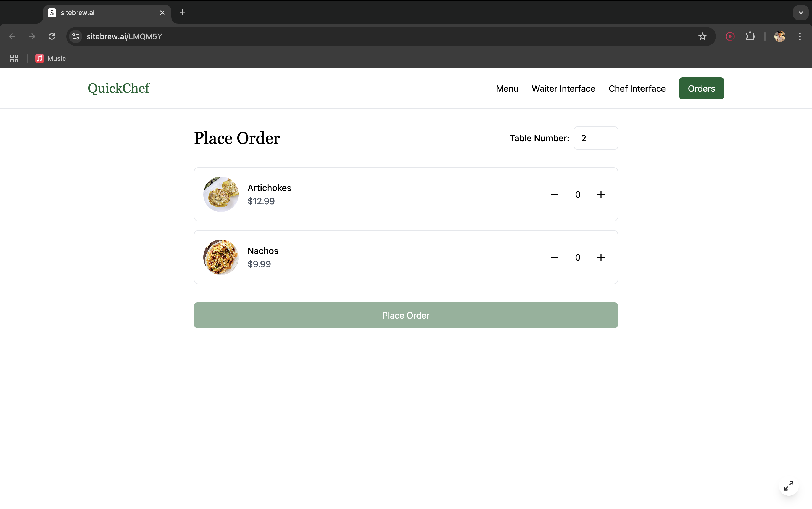

# QuickChef - Efficiency at its finest
QuickChef is a smart kitchen management tool that helps small bars optimise their cooking process by automating order prioritisation, improving efficiency, and ensuring dishes are prepared in the most timely and organised manner.

If you wish to access the directory through Github, use the following link:

https://github.com/adrianbarrios11/QuickChef/tree/main

|  Main Interface |  Chef Interface |  Waiter Interface |
|----------------------------------------------------------|----------------------------------------------------------|----------------------------------------------------------|

# Table of Contents
* [Introduction](#Introduction)
* [Installation](#Installation)
* [Usage](#usage)
* [Features](#features)
* [Considerations](#considerations)
* [Further Improvements](#further--improvements)
* [Credits](#credits)
  
# Introduction
QuickChef solves the problem of inefficiency and disorganisation in small bar kitchens by automating order prioritisation and streamlining the cooking process. It helps ensure that dishes are prepared in the right order, at the right time, and with minimal delays, improving kitchen workflow and overall customer satisfaction.

Unlike many kitchen management tools that primarily focus on inventory tracking or staff management, QuickChef's core feature is optimising cooking times and the order of meal preparation. By automating the cooking process and organising the kitchen queue, QuickChef ensures that meals are prepared efficiently and served on time.

## Installation
In order for the program to work, download the following files as a zip from this repository and store them locally in your computer. The most important files are:
* Menu.csv
* QuickChefApp.py

We are assuming you have an environment to run python in, such as VSCODE or Pycharm. Open the folder that appears when you open the zip file in one of these environments. If you need additional help, check out the following vide from 0:00 to 0:33.

https://www.youtube.com/watch?v=u3PMR8voOo0

Run the QuickChefApp.py file. The program was developed in PyCharm 2024.2.4 (Professional Edition)

The libraries used should come preinstalled with python3. If one of them is not pre-installed for you, you can run the following command in your terminal:

**pip install <name_of_missing_library>**

Using an IDE such as VSCODE (Free for Mac Users) or Pycharm can be useful. You need to ensure that you are running the main app in the same location where the Menu.csv is saved. If not, the program will not be able to read off of it.

Once all the requirements have been met, you should see a display on your screem. In order to access this interface, you will be asked to log in Username and Password, that will be the following:
* Username: admin
* Password :admin123

Once this has been done, you will have access to the main menu, showing different interfaces.
Whether you are a chef or a waiter at the restaurant, there is an interface for each. The interfaces included in the program are two. Chef interface and Waiter interface, where the characteristics of each of them are the following.

# Usage

# Chef Interface (1):
Within the chef’s interface, you are able to:

* View Orders (1.1): This option will allow you to visualize the current orders that the waiter has recorded, and which have not been prepared yet. From this interface you can return to either interface using the buttons below.

* Start Cooking (1.2): This option will take tapas and main dishes from the orders and put them in queues, ensuring there are never more than 3 tapas and 2 main dishes being prepared at the same time. It will always take the main dishes based on a time criteria. The tapas are added in a FIFO manner.

* View Currently Preparing Orders (1.2): This functionality will display the orders that are currently being prepared, after they have been selected by the StartCooking method. Their time complexity will be displayed.

* Send Out Completed Dishes (1.3): This allows the chef to state which dishes have been completed, in order for them to be delivered, therefore, they will be eliminated from the cooking orders queue.

* View Completed Orders (1.4): This functionality will display the orders that have been already marked as complete by the chef, in order to check the history of orders, or check if a dish has been marked as complete by mistake.

* Menu Management (1.5): This will take you into a subinterface where we can interact with the menu. You will be able to create, delete, or modify items on the menu. A gambas recipe is already included within the menu when you download our CSV.

* Return to Main Menu (1.6): When pressing this key, the main interface display again, giving the options to choose between chef or waiter interface again.

# Waiter Interface (2): 

* Add New Order (2.1): In this section, the waiter will be able to add a new order, selecting any of the previous dishes added with the add a recipe function, stored in the menu. These orders will be sent and our algorithm will process it. After order has been added, the chef can start cooking it in his interface.

* View Orders (2.2): This option will display all the orders that have been recorded by the waiter and are waiting to be “cooked” by the chef.

* Display Menu (2.3): This will display the menu, which is stored as a csv file. It will show the name, preparation time, type (main dish or tapas) and ingredients.

* Return to Main Menu (2.4): When pressing this key, the main menu will display again, giving the options to choose between chef and waiter interface again.

# Exit (3):
When selecting this option, the program will be quitted completely, therefore, a new session will be started again next time you enter QuickChef. This means the user will need to log in with the same credentials. Orders will be saved in the CSV file, meaning you won't have to create the recipes every time.

# Features
Waiters will be able to: 

* Annotate orders into the system, selecting directly from the menu that will be in front of them. No intermediate steps needed.
* Enter the table number for which the order has been taken.
* View all orders added to the system, allowing them to check for mistakes.

Chefs will be able to: 

* Access the order list and start the cooking queue.
* Read the current queue of orders, while they are cooking.
* Mark dishes as completed, allowing the queue to move over and asking for the waiter to pick it up.
* Modify the menu

# Considerations:

The images shown above belong to a mockup website made using the lovely.app. It represents an ideal final version with a more appealing UI. However, to implement the missing functionalities manually, we have chosen to use Tkinter Python interface.

In order to prevent undesired deletions when running the code several times, whenever we add a recipe, all of its characteristics will be stored into a csv file we named Menu.csv, The function will extend this csv file when new recipes are added. 

There is a constraint of 5 dishes (3 tapas, 2 main) being displayed in the chef interface at the same time to  prevent information overload for the chef . Of course, the queue will still be beyond this limit, it will just not print on the chef’s screen.

There are two queuing approaches that our algorithm focuses on. FIFO (for tapas) and priority queues for main dishes. The nature of these dishes are different, therefore these two parallel approaches are taken for queuing the dishes. Tapas do not take much time to create and are expected to be delivered quickly, therefore a First In First Out approach will be enough. However, for main dishes, durations affect the most efficient way of doing these dishes, therefore, they are more efficiently organised with priority queues, starting orders with longest duration first.

The program is mainly centered around Sorting as an algorithm

# Further Improvements

The interface for this project serves as a satisfiable MVP, but could be made more aesthetic. Through the use of Tkinter, we managed to create a simple, yet useful interface for users to interact with. However, through the use of  HTML and CSS we could potentially improve the visual appeal of the final product.

Additionally, having 2 different logins for chefs and waiters was something we explored, but did not manage to achieve. This would better divide the functionalities staff can access their corresponding interfaces (depending on whether they are waiters or chefs.)

# Credits
* Adrian Barrios
* Adrian Gonzalez
* Alvaro Martinez
* Hector Gregori
* Maria Subiela

