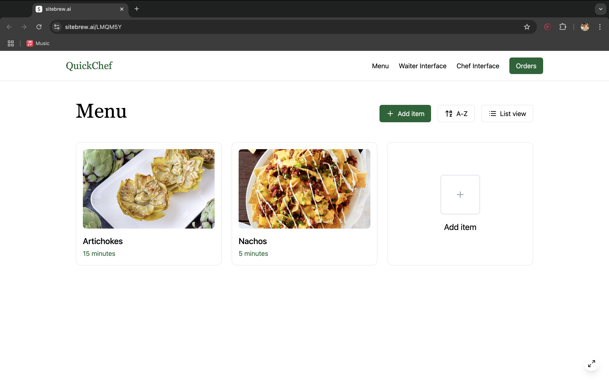
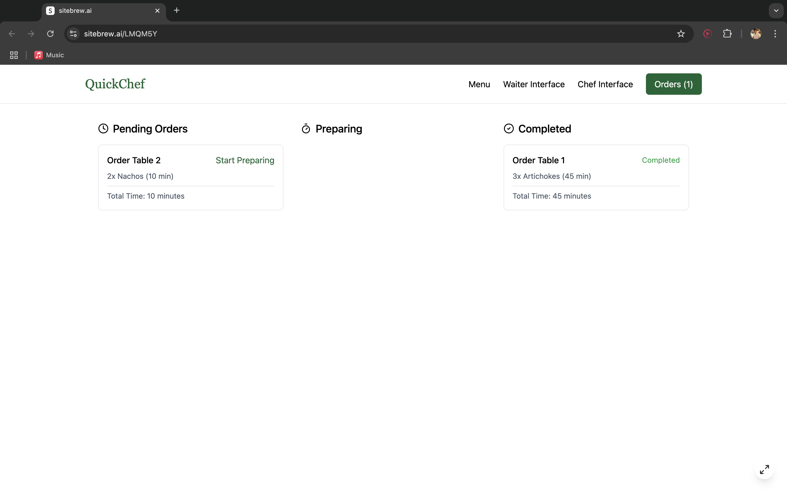

# QuickChef - Efficiency at its finest
QuickChef is a smart kitchen management tool that helps small bars optimise their cooking process by automating order prioritisation, improving efficiency, and ensuring dishes are prepared in the most timely and organised manner.

|  Main Interface |  Chef Interface |  Waiter Interface |
|----------------------------------------------------------|----------------------------------------------------------|----------------------------------------------------------|

# Table of Contents
* Introduction
* Installation
* Usage
* Features
* Credits
# Introduction
QuickChef solves the problem of inefficiency and disorganisation in small bar kitchens by automating order prioritisation and streamlining the cooking process. It helps ensure that dishes are prepared in the right order, at the right time, and with minimal delays, improving kitchen workflow and overall customer satisfaction.

Unlike many kitchen management tools that primarily focus on inventory tracking or staff management, QuickChef's core feature is optimising cooking times and the order of meal preparation. By automating the cooking process and organising the kitchen queue, QuickChef ensures that meals are prepared efficiently and served on time.

## Installation
In order for the program to work, download the files in this repository and store them locally in your computer. Run the app.py file assuming you have python3 installed. The program was developed in PyCharm 2024.2.4 (Professional Edition)

QuickChef counts with multiple interfaces that work together for all staff members. In order to access this interface, you will be asked to log in Username and Password, that will be the following:
* Username: admin
* Password :admin123

Once this has been done, you will have access to the main menu, showing different interfaces.
Whether you are a chef or a waiter at the restaurant, you will have your own interface. The interfaces included in the program are two. Chef interface and Waiter interface, where the characteristics of each of them are the following.

# Chef Interface (1):
Within the chef’s interface, you are able to:

* Start Cooking (1.1 ): This option will take all of the existing orders added by the waiter in order, following the criteria we previously established, depending on the type of dish it is. These orders will display on the chef interface, ready for him to start cooking following that order.

* View Currently Preparing Orders (1.2): This functionality will display the orders that are currently being prepared, after they have been selected by the StartCooking method. Their time complexity will be displayed.

* Send Out Completed Dishes (1.3): This allows the chef to state which dishes have been completed, in order for them to be delivered, therefore, they will be eliminated from the cooking orders queue.

* View Completed Orders (1.4): This functionality will display the orders that have been already marked as complete by the chef, in order to check the history of orders, or check if a dish has been marked as complete by mistake.

* Remove Menu Item (1.5): This functionality will prompt the user to remove an item from the menu.

* Return to Main Menu (1.6): When pressing this key, the main menu will display again, giving the options to choose between chef or waiter interface again.

# Waiter Interface (2): 

* Add New Order (2.1): In this section, the waiter will be able to add a new order, selecting any of the previous dishes added with the add a recipe function, stored in the menu. These orders will be sent and our algorithm will process it. After order has been added, information will appear correctly ordered in the chef interface.

* View Orders (2.2): This option will display all the orders that have been recorded by the waiter and are waiting to be “cooked” by the chef.

* Display Menu (2.3): This will display the menu, which is stored as a csv file.

* Return to Main Menu (2.4): When pressing this key, the main menu will display again, giving the options to choose between chef and waiter interface again.

# Add a new recipe (3):
When you choose this option, you will be prompted to indicate all of the details about this dish to make it work correctly with the algorithm. 
 
These details are:

* Name of the recipe
* Type of recipe tapas / main dish
* Ingredients (separated by commas)
* Time taken to complete the recipe

# Exit (4):
When selecting this option, the program will be quitted completely, therefore, a new session will be started again next time you enter QuickChef. This means the user will need to log in with the same credentials. Orders will need to be added again, and all of the process will start from the beginning, however recipes wont be deleted.

# Features
Waiters will be able to: 
Waiters will be able to directly annotate orders into the system, selecting directly from the menu that will be in front of them. No intermediate steps needed.
Enter the table number for which the order has been taken.
Waiters can view all orders added to the system, allowing them to check for mistakes.
Chefs will be able to: 
Chefs can access the order list and start the cooking queue.
Chefs will be able to organise which dishes are being cooked simultaneously.
Chefs will always be able to read the current queue of orders, while they are cooking
Chefs can mark dishes as completed, allowing the queue to move over and asking for the waiter to pick it up

# Main Considerations:
In order to prevent undesired deletions when running the code several times, whenever we add a recipe, all of its characteristics will be stored into a csv file we named Menu.csv, The function will extend this csv file when new recipes are added. 

There is a constraint of 5 ( 3 tapas, 2 main) dishes being displayed in the chef interface at the same time to  prevent information overload for the chef . Of course, the queue will still be beyond this limit, it will just not print on the chef’s screen. Whenever a dish is marked as completed, the next one in the queue will start appearing on the screen.

There are two queuing approaches that our algorithm focuses on. FIFO (for tapas) and priority queues for main dishes. The nature of these dishes are different, therefore these two parallel approaches are taken for queuing the dishes. Tapas do not take much time to create and are expected to be delivered quickly, therefore a First In First Out approach will be enough. However, for main dishes, durations affect the most efficient way of doing these dishes, therefore, they are more efficiently organised with priority queues, starting orders with longest duration first.

In order to make the commands in a much easier and quicker way for the waiter. The interface allows adding multiple dishes at a time to the queue, without needing to input the dishes being ordered one by one.

# Credits
* Adrian Barrios
* Adrian Gonzalez
* Alvaro Martinez
* Hector Gregori
* Maria Subiela

